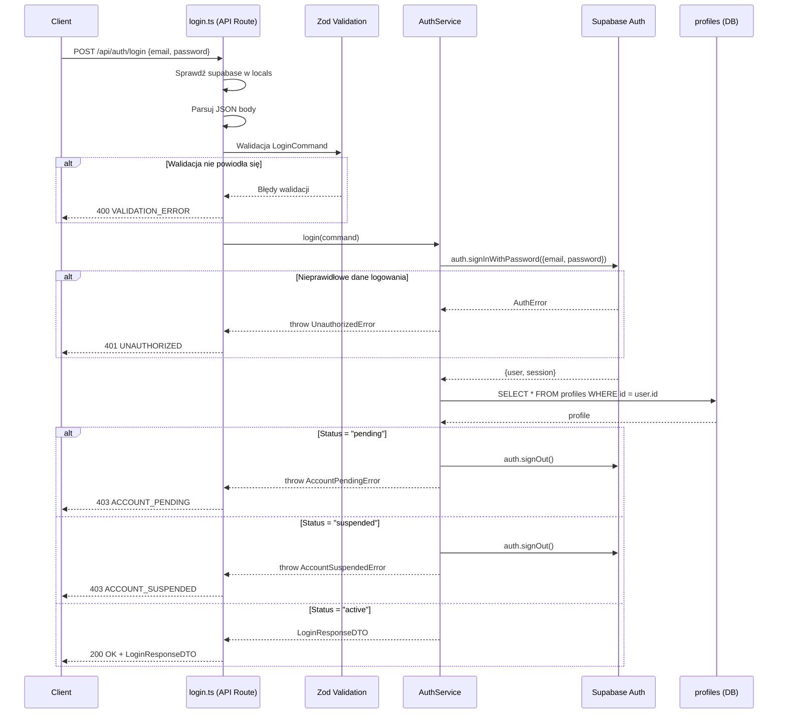

# API Endpoint Implementation Plan: POST /api/auth/login

## 1. Przegląd punktu końcowego

Endpoint `POST /api/auth/login` umożliwia uwierzytelnienie istniejącego konta schroniska. Supabase Auth weryfikuje dane logowania (`signInWithPassword`), a następnie serwis pobiera profil użytkownika i sprawdza jego status. Konta ze statusem `pending` lub `suspended` otrzymują odpowiedź `403`; ich sesje Auth są natychmiast unieważniane, zanim błąd dotrze do klienta. Poprawne logowanie zwraca tokeny sesji oraz skrócony profil schroniska.

Endpoint jest publiczny (niechroniony) — nie wymaga sesji ani tokenu autoryzacji.

## 2. Szczegóły żądania

- **Metoda HTTP:** POST
- **Struktura URL:** `/api/auth/login`
- **Parametry:**
  - Wymagane: brak (parametry w ciele żądania)
  - Opcjonalne: brak
- **Request Body:**

  ```json
  {
    "email": "shelter@example.com",
    "password": "SecureP@ssw0rd"
  }
  ```

  **Pola wymagane:**
  - `email` — adres e-mail (format email, max 255 znaków)
  - `password` — hasło (min 8 znaków, max 128 znaków)

## 3. Wykorzystywane typy

### Istniejące typy w `src/types.ts`

```typescript
/**
 * DTO 20: POST /api/auth/login - Successful login response
 */
export interface LoginResponseDTO {
  user: {
    id: string;
    email: string;
  };
  session: {
    access_token: string;
    refresh_token: string;
    expires_at: number;
  };
  profile: {
    id: string;
    status: ShelterStatus;
    role: UserRole;
  };
}

/**
 * Command 8: POST /api/auth/login - Login request body
 */
export interface LoginCommand {
  email: string;
  password: string;
}
```

### Istniejący schemat walidacji w `src/lib/validation/auth.schemas.ts`

```typescript
export const LoginCommandSchema = z.object({
  email: z
    .string({ required_error: "Email is required" })
    .email("Invalid email format")
    .max(255, "Email must not exceed 255 characters"),
  password: z
    .string({ required_error: "Password is required" })
    .min(8, "Password must be at least 8 characters")
    .max(128, "Password must not exceed 128 characters"),
});
```

## 4. Szczegóły odpowiedzi

### Sukces (200 OK)

```json
{
  "user": {
    "id": "uuid",
    "email": "shelter@example.com"
  },
  "session": {
    "access_token": "eyJ...",
    "refresh_token": "abc123",
    "expires_at": 1700000000
  },
  "profile": {
    "id": "uuid",
    "status": "active",
    "role": "shelter"
  }
}
```

### Błędy

| Kod HTTP | ErrorCode           | Opis                                         |
| :------- | :------------------ | :------------------------------------------- |
| 400      | `VALIDATION_ERROR`  | Brakujące/niepoprawne pola (email, hasło)    |
| 400      | `INVALID_REQUEST`   | Body nie jest poprawnym JSON                 |
| 401      | `UNAUTHORIZED`      | Nieprawidłowy email lub hasło                |
| 403      | `ACCOUNT_PENDING`   | Konto oczekuje na weryfikację administratora |
| 403      | `ACCOUNT_SUSPENDED` | Konto zawieszone                             |
| 500      | `INTERNAL_ERROR`    | Błąd serwera                                 |

## 5. Przepływ danych



## 6. Względy bezpieczeństwa

1. **Generyczny komunikat błędu 401:** `UnauthorizedError` zwraca komunikat `"Invalid email or password"` — nie ujawnia, czy email istnieje w systemie (ochrona przed enumeracją kont).

2. **Unieważnienie sesji przed odrzuceniem:** W przypadku kont `pending` i `suspended` sesja Supabase Auth jest unieważniana (`signOut`) **przed** zwróceniem błędu 403. Zapobiega to sytuacji, w której klient zachowuje ważny token po nieudanym logowaniu.

3. **Bezpieczne logowanie błędów wylogowania:** Błędy `signOut` (wywołanego przed odrzuceniem) są logowane przez `console.error` zamiast być cicho ignorowane.

4. **Sanityzacja odpowiedzi błędów:** Wewnętrzne komunikaty błędów (500) są zamieniane na generyczne "An internal error occurred" przez `createErrorHttpResponse`.

5. **HTTPS:** Vercel wymusza HTTPS — dane logowania są szyfrowane w transmisji.

## 7. Obsługa błędów

| Scenariusz                               | Kod HTTP | ErrorCode           | Komunikat                               |
| :--------------------------------------- | :------- | :------------------ | :-------------------------------------- |
| Body nie jest JSON                       | 400      | `INVALID_REQUEST`   | "Request body must be valid JSON"       |
| Brak wymaganych pól / niepoprawny format | 400      | `VALIDATION_ERROR`  | Szczegóły pól z Zod (tablica `details`) |
| Nieprawidłowy email lub hasło            | 401      | `UNAUTHORIZED`      | "Invalid email or password"             |
| Konto oczekuje na weryfikację            | 403      | `ACCOUNT_PENDING`   | "Account is pending verification"       |
| Konto zawieszone                         | 403      | `ACCOUNT_SUSPENDED` | "Account has been suspended"            |
| Błąd Supabase Auth (inny niż 401)        | 500      | `INTERNAL_ERROR`    | "An internal error occurred"            |
| Supabase client niedostępny              | 500      | `INTERNAL_ERROR`    | "Database connection not available"     |

## 8. Rozważania dotyczące wydajności

1. **Minimalna liczba operacji:** Endpoint wykonuje 2 operacje I/O: `auth.signInWithPassword` oraz `SELECT` z tabeli `profiles`. W przypadku statusu `pending`/`suspended` dochodzi trzecia operacja `auth.signOut`.

2. **Early returns:** Walidacja Zod i sprawdzenie `locals.supabase` są wykonywane przed jakąkolwiek operacją I/O.

3. **Indeks na `profiles.id`:** Klucz główny zapewnia natychmiastowe wyszukiwanie profilu po `user.id`.

## 9. Etapy wdrożenia

### Krok 1: Weryfikacja typów w `src/types.ts`

#### [VERIFY] [types.ts](file:///Users/sebastian/Projects/Shelterly/src/types.ts)

Upewnić się, że `LoginResponseDTO` i `LoginCommand` istnieją w pliku z poprawnymi polami.

---

### Krok 2: Weryfikacja schematu walidacji Zod

#### [VERIFY] [auth.schemas.ts](file:///Users/sebastian/Projects/Shelterly/src/lib/validation/auth.schemas.ts)

Upewnić się, że `LoginCommandSchema` poprawnie waliduje `email` i `password`.

---

### Krok 3: Weryfikacja klas błędów w `src/lib/errors.ts`

#### [VERIFY] [errors.ts](file:///Users/sebastian/Projects/Shelterly/src/lib/errors.ts)

Upewnić się, że `UnauthorizedError`, `AccountPendingError` i `AccountSuspendedError` istnieją.

---

### Krok 4: Implementacja metody `login` w `AuthService`

#### [MODIFY] [auth.service.ts](file:///Users/sebastian/Projects/Shelterly/src/lib/services/auth.service.ts)

Metoda `login(command: LoginCommand): Promise<LoginResponseDTO>`:

1. `supabase.auth.signInWithPassword({ email, password })`
2. Przy `authError` → `throw new UnauthorizedError("Invalid email or password")`
3. `supabase.from("profiles").select("id, status, role").eq("id", user.id).single()`
4. Przy błędzie profilu → `throw new InternalError(...)`
5. Jeśli `profile.status === "pending"`:
   - `await supabase.auth.signOut()` (błąd logowany przez `console.error`)
   - `throw new AccountPendingError()`
6. Jeśli `profile.status === "suspended"`:
   - `await supabase.auth.signOut()` (błąd logowany przez `console.error`)
   - `throw new AccountSuspendedError()`
7. Zwrócić `LoginResponseDTO`

---

### Krok 5: Implementacja route handlera

#### [VERIFY] [login.ts](file:///Users/sebastian/Projects/Shelterly/src/pages/api/auth/login.ts)

Zgodnie ze wzorcem:

1. `export const prerender = false`
2. `export const POST: APIRoute` z:
   - Sprawdzenie `locals.supabase`
   - Parsowanie JSON body z try/catch
   - Walidacja Zod (`LoginCommandSchema.safeParse`)
   - Delegacja do `AuthService.login()`
   - `logSuccess("POST /api/auth/login", { user_id })`
   - Zwrócenie `200 OK` z `LoginResponseDTO`
3. Catch block z mapowaniem:
   - `UnauthorizedError` → 401 `UNAUTHORIZED`
   - `AccountPendingError` → 403 `ACCOUNT_PENDING`
   - `AccountSuspendedError` → 403 `ACCOUNT_SUSPENDED`
   - Reszta → `logErrorWithContext` + 500

---

### Krok 6: Testy jednostkowe

#### [VERIFY] [login.test.ts](file:///Users/sebastian/Projects/Shelterly/src/pages/api/auth/login.test.ts)

**Scenariusze testowe:**

1. ✅ 500 — Brak supabase client
2. ✅ 400 — Niepoprawny JSON
3. ✅ 400 — Brak pola email
4. ✅ 400 — Brak pola password
5. ✅ 400 — Niepoprawny format email
6. ✅ 401 — Nieprawidłowe dane logowania (Supabase AuthError)
7. ✅ 403 — Konto ze statusem `pending`
8. ✅ 403 — Konto ze statusem `suspended`
9. ✅ 500 — Błąd przy pobieraniu profilu
10. ✅ 200 — Pomyślne logowanie z poprawnym `LoginResponseDTO`
11. ✅ Hasło nie pojawia się w odpowiedzi

## 10. Plan weryfikacji

### Testy automatyczne

Uruchomienie testów jednostkowych dla endpointu:

```bash
npx vitest run src/pages/api/auth/login.test.ts
```

Uruchomienie pełnego pakietu testów:

```bash
npx vitest run
```

### Weryfikacja manualna

Nie dotyczy — endpoint jest wyłącznie backendowy i może być wyczerpująco przetestowany testami jednostkowymi z mockami Supabase.
