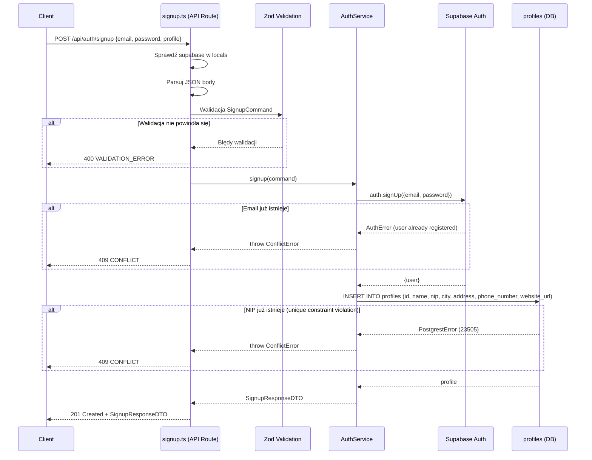

# API Endpoint Implementation Plan: POST /api/auth/signup

## 1. Przegląd punktu końcowego

Endpoint `POST /api/auth/signup` umożliwia rejestrację nowego konta schroniska w systemie. Proces rejestracji składa się z dwóch kroków wykonywanych w ramach jednej operacji: utworzenia konta użytkownika w Supabase Auth (`auth.signUp`) oraz wstawienia powiązanego profilu schroniska w tabeli `profiles`. Nowo zarejestrowane konto otrzymuje domyślny status `pending` i wymaga weryfikacji przez administratora, zanim schronisko uzyska pełny dostęp do systemu.

Endpoint jest publiczny (niechroniony) — nie wymaga sesji ani tokenu autoryzacji.

## 2. Szczegóły żądania

- **Metoda HTTP:** POST
- **Struktura URL:** `/api/auth/signup`
- **Parametry:**
  - Wymagane: brak (parametry w ciele żądania)
  - Opcjonalne: brak
- **Request Body:**

  ```json
  {
    "email": "shelter@example.com",
    "password": "SecureP@ssw0rd",
    "profile": {
      "name": "Schronisko dla Zwierząt w Warszawie",
      "nip": "1234567890",
      "city": "Warszawa",
      "address": "ul. Przykładowa 123",
      "phone_number": "+48123456789",
      "website_url": "https://example.com"
    }
  }
  ```

  **Pola wymagane:**
  - `email` — adres e-mail (format email, max 255 znaków)
  - `password` — hasło (min 8 znaków, max 128 znaków, wymagana co najmniej: wielka litera, mała litera, cyfra, znak specjalny)
  - `profile.name` — pełna nazwa schroniska (min 2, max 255 znaków)
  - `profile.nip` — NIP (dokładnie 10 cyfr, regex `^\d{10}$`)
  - `profile.city` — miasto (min 2, max 100 znaków)
  - `profile.address` — adres (min 5, max 255 znaków)

  **Pola opcjonalne:**
  - `profile.phone_number` — telefon kontaktowy (opcjonalny, format: regex `^\+?[0-9\s\-]{7,20}$`)
  - `profile.website_url` — strona internetowa (opcjonalna, format URL)

## 3. Wykorzystywane typy

### Nowe typy (do dodania w `src/types.ts`)

```typescript
/**
 * DTO 21: POST /api/auth/signup - Successful registration response
 */
export interface SignupResponseDTO {
  message: string;
  user: {
    id: string;
    email: string;
  };
  profile: {
    id: string;
    status: ShelterStatus;
    name: string;
  };
}

/**
 * Command 9: POST /api/auth/signup - Registration request body
 */
export interface SignupCommand {
  email: string;
  password: string;
  profile: {
    name: string;
    nip: string;
    city: string;
    address: string;
    phone_number?: string;
    website_url?: string;
  };
}
```

### Nowy schemat walidacji (dodanie do `src/lib/validation/auth.schemas.ts`)

```typescript
export const SignupCommandSchema = z.object({
  email: z
    .string({ required_error: "Email is required" })
    .email("Invalid email format")
    .max(255, "Email must not exceed 255 characters"),
  password: z
    .string({ required_error: "Password is required" })
    .min(8, "Password must be at least 8 characters")
    .max(128, "Password must not exceed 128 characters")
    .regex(/[a-z]/, "Password must contain at least one lowercase letter")
    .regex(/[A-Z]/, "Password must contain at least one uppercase letter")
    .regex(/[0-9]/, "Password must contain at least one digit")
    .regex(/[^a-zA-Z0-9]/, "Password must contain at least one special character"),
  profile: z.object({
    name: z
      .string({ required_error: "Shelter name is required" })
      .min(2, "Shelter name must be at least 2 characters")
      .max(255, "Shelter name must not exceed 255 characters"),
    nip: z.string({ required_error: "NIP is required" }).regex(/^\d{10}$/, "NIP must be exactly 10 digits"),
    city: z
      .string({ required_error: "City is required" })
      .min(2, "City must be at least 2 characters")
      .max(100, "City must not exceed 100 characters"),
    address: z
      .string({ required_error: "Address is required" })
      .min(5, "Address must be at least 5 characters")
      .max(255, "Address must not exceed 255 characters"),
    phone_number: z
      .string()
      .regex(/^\+?[0-9\s\-]{7,20}$/, "Invalid phone number format")
      .optional(),
    website_url: z.string().url("Invalid website URL format").optional(),
  }),
});
```

## 4. Szczegóły odpowiedzi

### Sukces (201 Created)

```json
{
  "message": "Registration successful. Please wait for verification.",
  "user": {
    "id": "uuid",
    "email": "shelter@example.com"
  },
  "profile": {
    "id": "uuid",
    "status": "pending",
    "name": "Schronisko dla Zwierząt w Warszawie"
  }
}
```

### Błędy

| Kod HTTP | ErrorCode          | Opis                                              |
| :------- | :----------------- | :------------------------------------------------ |
| 400      | `VALIDATION_ERROR` | Brakujące/niepoprawne pola (email, hasło, profil) |
| 400      | `INVALID_REQUEST`  | Body nie jest poprawnym JSON                      |
| 409      | `CONFLICT`         | Email lub NIP już istnieje                        |
| 500      | `INTERNAL_ERROR`   | Błąd serwera                                      |

## 5. Przepływ danych



## 6. Względy bezpieczeństwa

1. **Silne wymagania haseł:** Zod schema wymusza minimum 8 znaków, wielką i małą literę, cyfrę oraz znak specjalny — ochrona przed słabymi hasłami.

2. **Walidacja NIP:** Regex `^\d{10}$` w schemacie Zod oraz ograniczenie `UNIQUE` w bazie danych — zapobiega duplikatom i gwarantuje poprawny format.

3. **Ochrona przed duplikatami:** Zarówno email (Supabase Auth) jak i NIP (DB constraint) są chronione przez ograniczenia unikalności. Przy próbie rejestracji z istniejącym emailem/NIP zwracamy generyczny komunikat `409 CONFLICT` bez ujawniania, które pole jest duplikatem (ochrona przed enumeracją).

4. **Bezpieczne logowanie błędów:** Funkcja `logErrorWithContext` automatycznie redaguje pola `password`, `email`, `nip` — dane wrażliwe nigdy nie trafiają do logów.

5. **Sanityzacja odpowiedzi błędów:** Wewnętrzne komunikaty błędów (500) są zamieniane na generyczne "An internal error occurred" przez `createErrorHttpResponse`.

6. **Brak tokenów sesji w odpowiedzi:** Endpoint signup nie zwraca tokenów sesji — użytkownik musi się zalogować osobno po weryfikacji konta.

7. **Rate limiting:** Supabase Auth posiada wbudowane rate limiting na `auth.signUp`, chroniąc przed masowym tworzeniem kont.

8. **HTTPS:** Vercel wymusza HTTPS — dane rejestracyjne są szyfrowane w transmisji.

## 7. Obsługa błędów

| Scenariusz                               | Kod HTTP | ErrorCode          | Komunikat                                          |
| :--------------------------------------- | :------- | :----------------- | :------------------------------------------------- |
| Body nie jest JSON                       | 400      | `INVALID_REQUEST`  | "Request body must be valid JSON"                  |
| Brak wymaganych pól / niepoprawny format | 400      | `VALIDATION_ERROR` | Szczegóły pól z Zod (tablica `details`)            |
| Niepoprawny format NIP (nie 10 cyfr)     | 400      | `VALIDATION_ERROR` | "NIP must be exactly 10 digits"                    |
| Hasło za słabe                           | 400      | `VALIDATION_ERROR` | Odpowiedni komunikat o wymaganiach hasła           |
| Email już zarejestrowany                 | 409      | `CONFLICT`         | "An account with this email or NIP already exists" |
| NIP już istnieje (unique constraint)     | 409      | `CONFLICT`         | "An account with this email or NIP already exists" |
| Błąd Supabase Auth (inny niż duplikat)   | 500      | `INTERNAL_ERROR`   | "An internal error occurred"                       |
| Błąd INSERT do tabeli profiles           | 500      | `INTERNAL_ERROR`   | "An internal error occurred"                       |
| Supabase client niedostępny              | 500      | `INTERNAL_ERROR`   | "Database connection not available"                |

## 8. Rozważania dotyczące wydajności

1. **Minimalna liczba operacji:** Endpoint wykonuje dokładnie 2 operacje: `auth.signUp` i `INSERT` do `profiles`. Żadne dodatkowe zapytania nie są potrzebne.

2. **Rollback przy częściowym błędzie:** Jeśli `INSERT` do `profiles` się nie powiedzie po pomyślnym `auth.signUp`, nowy użytkownik w Supabase Auth nie będzie miał profilu. Supabase trigger `on_auth_user_created` może obsłużyć tworzenie profilu, ale w naszym przypadku robimy to jawnie w serwisie. W razie błędu INSERT logujemy kontekst i zwracamy 500 — użytkownik może spróbować ponownie (Supabase Auth wykryje duplikat emaila i sytuacja jest kontrolowana). Alternatywnie, można korzystać z Supabase trigger.

3. **Early returns:** Walidacja Zod i sprawdzenie `locals.supabase` są wykonywane przed jakąkolwiek operacją I/O.

4. **Indeks UNIQUE na `nip`:** Zapewnia szybkie wykrywanie duplikatów NIP bez konieczności wykonywania dodatkowego SELECT.

## 9. Etapy wdrożenia

### Krok 1: Dodanie nowych typów do `src/types.ts`

#### [MODIFY] [types.ts](file:///Users/sebastian/Projects/Shelterly/src/types.ts)

- Dodanie `SignupResponseDTO` w sekcji **Auth DTOs** (po `LoginResponseDTO`)
- Dodanie `SignupCommand` w sekcji **Command Models** (po `LoginCommand`)

---

### Krok 2: Dodanie klasy `ConflictError` w `src/lib/errors.ts`

#### [MODIFY] [errors.ts](file:///Users/sebastian/Projects/Shelterly/src/lib/errors.ts)

Dodać nową klasę błędu po `AccountSuspendedError`:

```typescript
export class ConflictError extends Error {
  constructor(message = "Resource already exists") {
    super(message);
    this.name = "ConflictError";
  }
}
```

---

### Krok 3: Rozszerzenie schematu walidacji Zod

#### [MODIFY] [auth.schemas.ts](file:///Users/sebastian/Projects/Shelterly/src/lib/validation/auth.schemas.ts)

Dodać `SignupCommandSchema` z pełną walidacją:

- `email`: wymagany, format email, max 255 znaków
- `password`: wymagany, min 8 znaków, max 128 znaków, regex dla siły hasła
- `profile.name`: wymagany, min 2, max 255 znaków
- `profile.nip`: wymagany, regex `^\d{10}$`
- `profile.city`: wymagany, min 2, max 100 znaków
- `profile.address`: wymagany, min 5, max 255 znaków
- `profile.phone_number`: opcjonalny, regex `^\+?[0-9\s\-]{7,20}$`
- `profile.website_url`: opcjonalny, format URL

---

### Krok 4: Rozszerzenie `AuthService` o metodę `signup`

#### [MODIFY] [auth.service.ts](file:///Users/sebastian/Projects/Shelterly/src/lib/services/auth.service.ts)

Dodać metodę `signup(command: SignupCommand): Promise<SignupResponseDTO>`:

1. `supabase.auth.signUp({ email: command.email, password: command.password })`
2. Przy `authError`:
   - Jeśli komunikat zawiera "User already registered" → `throw new ConflictError("An account with this email or NIP already exists")`
   - W przeciwnym razie → `throw new InternalError("Registration failed")`
3. Jeśli brak `user` → `throw new InternalError("Registration failed")`
4. `supabase.from("profiles").insert({...}).select("id, status, name").single()`
5. Przy `profileError`:
   - Jeśli `code === "23505"` (unique violation na NIP) → `throw new ConflictError("An account with this email or NIP already exists")`
   - W przeciwnym razie → `throw new InternalError("Failed to create profile")`
6. Zwrócić `SignupResponseDTO`

---

### Krok 5: Implementacja route handlera

#### [NEW] [signup.ts](file:///Users/sebastian/Projects/Shelterly/src/pages/api/auth/signup.ts)

Zgodnie ze wzorcem z `login.ts`:

1. `export const prerender = false`
2. `export const POST: APIRoute` z:
   - Sprawdzenie `locals.supabase`
   - Parsowanie JSON body z try/catch
   - Walidacja Zod (`SignupCommandSchema.safeParse`)
   - Delegacja do `AuthService.signup()`
   - `logSuccess("POST /api/auth/signup", { user_id })`
   - Zwrócenie `201 Created` z `SignupResponseDTO`
3. Catch block z mapowaniem:
   - `ConflictError` → 409 `CONFLICT`
   - Reszta → `logErrorWithContext` + 500

---

### Krok 6: Testy jednostkowe

#### [NEW] [signup.test.ts](file:///Users/sebastian/Projects/Shelterly/src/pages/api/auth/signup.test.ts)

Zgodnie ze wzorcem z `login.test.ts`:

**Scenariusze testowe:**

1. ✅ 500 — Brak supabase client
2. ✅ 400 — Niepoprawny JSON
3. ✅ 400 — Brak pola email
4. ✅ 400 — Brak pola password
5. ✅ 400 — Brak obiektu profile
6. ✅ 400 — Brak wymaganych pól profilu (name, nip, city, address)
7. ✅ 400 — Niepoprawny format email
8. ✅ 400 — Hasło za krótkie (mniej niż 8 znaków)
9. ✅ 400 — Hasło bez wymaganej złożoności (brak wielkiej litery, cyfry, znaku specjalnego)
10. ✅ 400 — Niepoprawny format NIP (nie 10 cyfr)
11. ✅ 400 — Niepoprawny format phone_number
12. ✅ 400 — Niepoprawny format website_url
13. ✅ 409 — Email już zarejestrowany (Supabase Auth error)
14. ✅ 409 — NIP już istnieje (unique constraint violation 23505)
15. ✅ 500 — Błąd Supabase Auth (inny niż duplikat)
16. ✅ 500 — Błąd INSERT do profiles (inny niż unique violation)
17. ✅ 500 — Brak user w odpowiedzi auth.signUp
18. ✅ 201 — Pomyślna rejestracja z poprawnym `SignupResponseDTO`
19. ✅ 201 — Pomyślna rejestracja bez opcjonalnych pól (phone_number, website_url)
20. ✅ Hasło nie pojawia się w odpowiedzi

## 10. Plan weryfikacji

### Testy automatyczne

Uruchomienie testów jednostkowych dla nowego endpointu:

```bash
npx vitest run src/pages/api/auth/signup.test.ts
```

Uruchomienie pełnego pakietu testów (upewnienie się, że zmiany w `errors.ts` i `types.ts` nie łamią istniejących testów):

```bash
npx vitest run
```

### Weryfikacja manualna

Nie dotyczy — endpoint jest wyłącznie backendowy i może być wyczerpująco przetestowany testami jednostkowymi z mockami Supabase.
