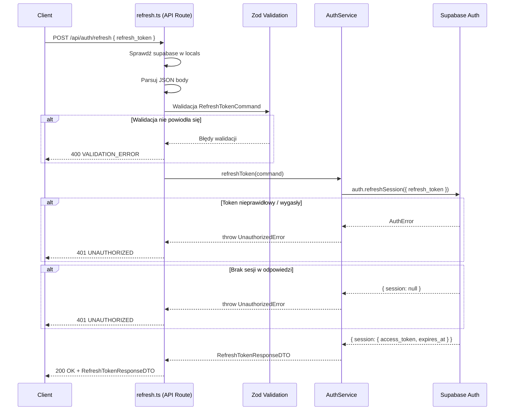

# API Endpoint Implementation Plan: POST /api/auth/refresh

## 1. Przegląd punktu końcowego

Endpoint `POST /api/auth/refresh` umożliwia odświeżenie tokenu dostępu (access token) przy użyciu ważnego refresh tokenu. Klient przesyła swój `refresh_token`, a serwer wywołuje `supabase.auth.refreshSession()`, która zwraca nową parę tokenów. Endpoint zwraca wyłącznie nowy `access_token` i jego `expires_at` — refresh token jest zarządzany wewnętrznie przez Supabase i rotowany automatycznie.

Endpoint jest publiczny w kontekście sesji — nie wymaga nagłówka `Authorization`, ponieważ sam refresh token stanowi uwierzytelnienie. Supabase SDK weryfikuje i rotuje token po stronie serwera.

## 2. Szczegóły żądania

- **Metoda HTTP:** POST
- **Struktura URL:** `/api/auth/refresh`
- **Parametry:**
  - Wymagane: brak (parametry w ciele żądania)
  - Opcjonalne: brak
- **Request Body:**

  ```json
  {
    "refresh_token": "refresh_token"
  }
  ```

  **Pola wymagane:**
  - `refresh_token` — token odświeżania (string, niepusty)

## 3. Wykorzystywane typy

### Nowe typy (do dodania w `src/types.ts`)

```typescript
/**
 * DTO 23: POST /api/auth/refresh - Successful token refresh response
 */
export interface RefreshTokenResponseDTO {
  access_token: string;
  expires_at: number;
}

/**
 * Command 10: POST /api/auth/refresh - Refresh token request body
 */
export interface RefreshTokenCommand {
  refresh_token: string;
}
```

### Nowy schemat walidacji (do dodania w `src/lib/validation/auth.schemas.ts`)

```typescript
/**
 * Zod validation schema for POST /api/auth/refresh request body.
 * Validates that refresh_token is a non-empty string.
 */
export const RefreshTokenCommandSchema = z.object({
  refresh_token: z.string({ required_error: "Refresh token is required" }).min(1, "Refresh token must not be empty"),
});
```

## 4. Szczegóły odpowiedzi

### Sukces (200 OK)

```json
{
  "access_token": "new_jwt_token",
  "expires_at": 1234567890
}
```

### Błędy

| Kod HTTP | ErrorCode          | Opis                                                 |
| :------- | :----------------- | :--------------------------------------------------- |
| 400      | `VALIDATION_ERROR` | Brakujące/niepoprawne pole `refresh_token`           |
| 400      | `INVALID_REQUEST`  | Body nie jest poprawnym JSON                         |
| 401      | `UNAUTHORIZED`     | Nieprawidłowy lub wygasły refresh token              |
| 500      | `INTERNAL_ERROR`   | Nieoczekiwany błąd serwera (Supabase lub wewnętrzny) |

## 5. Przepływ danych



## 6. Względy bezpieczeństwa

1. **Brak ujawniania szczegółów błędu:** Przy nieprawidłowym lub wygasłym refresh tokenie zwracamy generyczny komunikat `"Invalid or expired refresh token"` — nie ujawniamy, czy token wygasł, został unieważniony, czy nigdy nie istniał.

2. **Automatyczna rotacja tokenów:** Supabase automatycznie rotuje refresh token przy każdym użyciu (jeśli włączone w konfiguracji). Nowy refresh token jest zarządzany wewnętrznie przez SDK.

3. **Brak refresh tokena w odpowiedzi:** Zgodnie ze specyfikacją API, odpowiedź zawiera wyłącznie `access_token` i `expires_at`. Refresh token nie jest eksponowany w odpowiedzi.

4. **Bezpieczne logowanie:** `logErrorWithContext` automatycznie redaguje pola `token` — refresh token nigdy nie trafia do logów w czytelnej formie.

5. **Sanityzacja błędów wewnętrznych:** Odpowiedzi z kodem 500 zawierają generyczny komunikat `"An internal error occurred"` dzięki `createErrorHttpResponse`.

6. **HTTPS:** Vercel wymusza HTTPS — tokeny są szyfrowane w transmisji.

7. **Rate limiting:** Supabase Auth posiada wbudowane rate limiting na operacje odświeżania tokenu.

## 7. Obsługa błędów

| Scenariusz                                  | Kod HTTP | ErrorCode          | Komunikat                           |
| :------------------------------------------ | :------- | :----------------- | :---------------------------------- |
| Body nie jest JSON                          | 400      | `INVALID_REQUEST`  | "Request body must be valid JSON"   |
| Brak pola `refresh_token`                   | 400      | `VALIDATION_ERROR` | Szczegóły z Zod (tablica `details`) |
| Pusty `refresh_token`                       | 400      | `VALIDATION_ERROR` | "Refresh token must not be empty"   |
| Refresh token nieprawidłowy                 | 401      | `UNAUTHORIZED`     | "Invalid or expired refresh token"  |
| Refresh token wygasły                       | 401      | `UNAUTHORIZED`     | "Invalid or expired refresh token"  |
| Supabase zwraca brak sesji (session = null) | 401      | `UNAUTHORIZED`     | "Invalid or expired refresh token"  |
| Supabase client niedostępny                 | 500      | `INTERNAL_ERROR`   | "Database connection not available" |
| Nieoczekiwany błąd serwera                  | 500      | `INTERNAL_ERROR`   | "An internal error occurred"        |

## 8. Rozważania dotyczące wydajności

1. **Minimalna liczba operacji:** Endpoint wykonuje dokładnie 1 operację na Supabase Auth (`refreshSession`). Brak zapytań do bazy danych — cała logika jest po stronie Supabase Auth.

2. **Brak operacji na tabeli `profiles`:** W przeciwieństwie do endpointu login, refresh nie sprawdza statusu profilu — zakładamy, że sesja użytkownika była ważna w momencie wydania refresh tokenu.

3. **Early returns:** Walidacja Zod i sprawdzenie `locals.supabase` są wykonywane przed operacją I/O na Supabase Auth.

4. **Lekka odpowiedź:** Odpowiedź zawiera tylko 2 pola (`access_token`, `expires_at`), minimalizując rozmiar payloadu.

## 9. Etapy wdrożenia

### Krok 1: Dodanie nowych typów do `src/types.ts`

#### [MODIFY] [types.ts](file:///Users/sebastian/Projects/Shelterly/src/types.ts)

Dodać w sekcji **Auth DTOs** (po `LogoutResponseDTO`):

```typescript
/**
 * DTO 23: POST /api/auth/refresh - Successful token refresh response
 */
export interface RefreshTokenResponseDTO {
  access_token: string;
  expires_at: number;
}
```

Dodać w sekcji **Command Models** (po `SignupCommand`):

```typescript
/**
 * Command 10: POST /api/auth/refresh - Refresh token request body
 */
export interface RefreshTokenCommand {
  refresh_token: string;
}
```

---

### Krok 2: Dodanie schematu walidacji Zod

#### [MODIFY] [auth.schemas.ts](file:///Users/sebastian/Projects/Shelterly/src/lib/validation/auth.schemas.ts)

Dodać `RefreshTokenCommandSchema` na końcu pliku:

```typescript
/**
 * Zod validation schema for POST /api/auth/refresh request body.
 * Validates that refresh_token is a non-empty string.
 */
export const RefreshTokenCommandSchema = z.object({
  refresh_token: z.string({ required_error: "Refresh token is required" }).min(1, "Refresh token must not be empty"),
});
```

---

### Krok 3: Rozszerzenie `AuthService` o metodę `refreshToken`

#### [MODIFY] [auth.service.ts](file:///Users/sebastian/Projects/Shelterly/src/lib/services/auth.service.ts)

1. Dodać import `RefreshTokenCommand` i `RefreshTokenResponseDTO` do istniejącej listy importów z `@/types`.
2. Dodać metodę `refreshToken(command: RefreshTokenCommand): Promise<RefreshTokenResponseDTO>`:
   - Wywołać `this.supabase.auth.refreshSession({ refresh_token: command.refresh_token })`
   - Jeśli `authError` lub brak `session` → `throw new UnauthorizedError("Invalid or expired refresh token")`
   - Zwrócić `{ access_token: session.access_token, expires_at: session.expires_at ?? 0 }`

```typescript
/**
 * Refreshes the access token using a valid refresh token.
 *
 * Flow:
 * 1. Calls Supabase Auth `refreshSession` with the provided refresh token.
 * 2. If authError or session is null — throws UnauthorizedError.
 * 3. Returns RefreshTokenResponseDTO with new access_token and expires_at.
 *
 * @param command - Refresh token command ({ refresh_token })
 * @returns RefreshTokenResponseDTO with new access token and expiry
 * @throws UnauthorizedError if refresh token is invalid or expired
 */
async refreshToken(command: RefreshTokenCommand): Promise<RefreshTokenResponseDTO> {
  const { data, error: authError } = await this.supabase.auth.refreshSession({
    refresh_token: command.refresh_token,
  });

  if (authError || !data.session) {
    throw new UnauthorizedError("Invalid or expired refresh token");
  }

  return {
    access_token: data.session.access_token,
    expires_at: data.session.expires_at ?? 0,
  };
}
```

---

### Krok 4: Implementacja route handlera

#### [NEW] [refresh.ts](file:///Users/sebastian/Projects/Shelterly/src/pages/api/auth/refresh.ts)

Zgodnie ze wzorcem z `login.ts`:

1. `export const prerender = false`
2. `export const POST: APIRoute` z:
   - Sprawdzenie `locals.supabase`
   - Parsowanie JSON body z try/catch
   - Walidacja Zod (`RefreshTokenCommandSchema.safeParse`)
   - Delegacja do `AuthService.refreshToken()`
   - `logSuccess("POST /api/auth/refresh")`
   - Zwrócenie `200 OK` z `RefreshTokenResponseDTO`
3. Catch block z mapowaniem:
   - `UnauthorizedError` → 401 `UNAUTHORIZED`
   - Pozostałe → `logErrorWithContext` + 500 `INTERNAL_ERROR`

```typescript
import type { APIRoute } from "astro";
import { AuthService } from "@/lib/services/auth.service";
import { RefreshTokenCommandSchema } from "@/lib/validation/auth.schemas";
import {
  createErrorHttpResponse,
  createValidationErrorResponse,
  logErrorWithContext,
  logSuccess,
  UnauthorizedError,
} from "@/lib/errors";

export const prerender = false;

/**
 * POST /api/auth/refresh
 *
 * Refreshes the access token using a valid refresh token.
 * Returns a new access_token and its expires_at timestamp.
 *
 * Request body: { refresh_token: string }
 * Response: RefreshTokenResponseDTO (200 OK)
 */
export const POST: APIRoute = async ({ request, locals }) => {
  const supabase = locals.supabase;
  if (!supabase) {
    return createErrorHttpResponse("INTERNAL_ERROR", "Database connection not available", 500);
  }

  let rawBody: unknown;
  try {
    rawBody = await request.json();
  } catch {
    return createErrorHttpResponse("INVALID_REQUEST", "Request body must be valid JSON", 400);
  }

  const validationResult = RefreshTokenCommandSchema.safeParse(rawBody);
  if (!validationResult.success) {
    return createValidationErrorResponse(validationResult.error.errors);
  }

  const command = validationResult.data;

  try {
    const authService = new AuthService(supabase);
    const result = await authService.refreshToken(command);

    logSuccess("POST /api/auth/refresh");

    return new Response(JSON.stringify(result), {
      status: 200,
      headers: { "Content-Type": "application/json" },
    });
  } catch (error) {
    if (error instanceof UnauthorizedError) {
      return createErrorHttpResponse("UNAUTHORIZED", error.message, 401);
    }

    logErrorWithContext(
      {
        endpoint: "POST /api/auth/refresh",
      },
      error
    );

    return createErrorHttpResponse("INTERNAL_ERROR", "An internal error occurred", 500);
  }
};
```

---

### Krok 5: Testy jednostkowe

#### [NEW] [refresh.test.ts](file:///Users/sebastian/Projects/Shelterly/src/pages/api/auth/refresh.test.ts)

Zgodnie ze wzorcem z `login.test.ts`:

**Scenariusze testowe:**

1. ✅ 500 — Brak supabase client
2. ✅ 400 — Niepoprawny JSON
3. ✅ 400 — Brak pola `refresh_token` (pusty obiekt)
4. ✅ 400 — Pusty `refresh_token` (pusty string)
5. ✅ 400 — `refresh_token` nie jest stringiem (np. liczba)
6. ✅ 401 — Supabase zwraca `authError` (nieprawidłowy token)
7. ✅ 401 — Supabase zwraca `session: null` bez `authError`
8. ✅ 500 — Nieoczekiwany wyjątek rzucony przez service (np. błąd sieciowy)
9. ✅ 200 — Pomyślne odświeżenie z poprawnym `RefreshTokenResponseDTO`
10. ✅ 200 — Odpowiedź nie zawiera `refresh_token`
11. ✅ 200 — Odpowiedź zawiera dokładnie `access_token` i `expires_at`

## 10. Plan weryfikacji

### Testy automatyczne

Uruchomienie testów dla nowego endpointu:

```bash
npx vitest run src/pages/api/auth/refresh.test.ts
```

Uruchomienie pełnego pakietu testów (upewnienie się, że zmiany w `types.ts`, `auth.schemas.ts` i `auth.service.ts` nie łamią istniejących testów):

```bash
npx vitest run
```

### Weryfikacja manualna

Nie dotyczy — endpoint jest wyłącznie backendowy i może być wyczerpująco przetestowany testami jednostkowymi z mockami Supabase.
